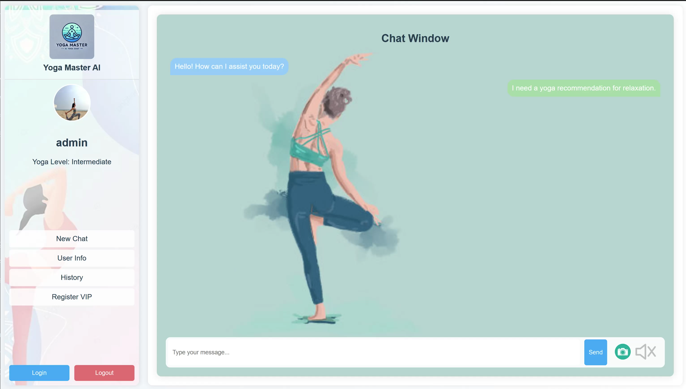

## SECTION 1 : PROJECT TITLE
## Yoga Master

---

## SECTION 2 : EXECUTIVE SUMMARY / PAPER ABSTRACT
As modern life becomes increasingly fast-paced and stressful, more people are turning their attention to mental and physical well-being. Yoga, as a holistic mind-body exercise, has gradually gained widespread attention. It not only enhances flexibility and strength but also effectively alleviates stress, improves sleep quality, and helps manage chronic pain, making it popular among a growing number of practitioners. However, many yoga enthusiasts lack professional guidance, leading to frequent posture inaccuracies that can diminish the effectiveness of their practice or, worse, result in discomfort or injury.

This project aims to develop an intelligent yoga recommendation and evaluation system that combines Natural Language Processing (NLP) and computer vision technologies to offer users personalized yoga posture recommendations and real-time feedback. Based on the user’s yoga level, goals, and health conditions, the system provides safe and tailored posture suggestions. Additionally, the posture recognition feature analyzes and assesses the accuracy of the user’s poses in real time, allowing users to correct mistakes promptly, ensuring both safe and effective practice. For users with specific health requirements, such as back pain or knee issues, the system prioritizes poses that are body-friendly and avoids movements that may cause discomfort.

With its advanced posture recognition and personalized recommendation capabilities, this system not only enhances the yoga experience but also provides users with a scientific, safe, and goal-aligned yoga practice solution. In the rapidly growing global yoga market, this project fills the gap for personalized guidance and posture evaluation tools, offering users an innovative and intelligent yoga solution.

---

## SECTION 3 : CREDITS / PROJECT CONTRIBUTION

| Official Full Name  | Student ID (MTech Applicable)  | Work Items (Who Did What) | Email (Optional) |
| :------------ |:---------------:| :-----| :-----|
| Li Qiuxian | A0297598X | Backend Development, Debug recommend algorithm, Demo Presentation, Write Report| e1351736@u.nus.edu |
| Gao Yunjia | A0295502E | Recommend algorithm Development, NLP component development, UI-Design, Video Presentation, Write Report| e1349640@u.nus.edu  |
| Zhao Lanting | A0297676A | UI-Design, Frontend Development, Demo Presentation, Write Report| e1351814@u.nus.edu |
| Liu Weixuan | A0295682M | Recommend algorithm Development, Video Presentation, Collect and clean dataset, Write Report| e1349820@u.nus.edu |
| Huang Yongle Joshua | A0028090M | Business-Rule development, Rule text design, Architecture Diagram Design, Write Report| e0737921@u.nus.edu |

---

## SECTION 4 : VIDEO OF SYSTEM MODELLING & USE CASE DEMO

---

## SECTION 5 : USER GUIDE

`Refer to appendix <Installation & User Guide> in project report at Github Folder: ProjectReport`

### [ 1 ] Environment Requirement

> pip install requirements

### [ 2 ] To run the system in local machine:

> open terminal in our local fold file

> $ git clone https://github.com/A9gust/HotelRecommendationSystem.git

> $ cd HotelRecommendationSystem

> $ npm run serve
> $ cd HotelRecommendationSystem/backend

> $ npm run serve

> **Go to URL using web browser http://0.0.0.0:8080 or http://127.0.0.1:8080

---
## SECTION 6 : PROJECT REPORT / PAPER

`Refer to project report at Github Folder: ProjectReport`

**Recommended Sections for Project Report / Paper:**
- Introduction
- Market Research
- Business Value
- Objectives of Project
- Overview of Dataset
- System Design
- System Development & Implementation
- Findings and Discussion
- Appendix 1: Mapped System Functionalities Against Knowledge
- Appendix 2: Installation & User Guide

---
## SECTION 7 : MISCELLANEOUS

`Refer to Github Folder: Miscellaneous`

### la0730.csv
* Dataset of hotel name and information
* The most basic hotel database used by the system
### trainset.csv
* Combined with clustering result and rating matrix
* Use to train a model for CF algorithm

